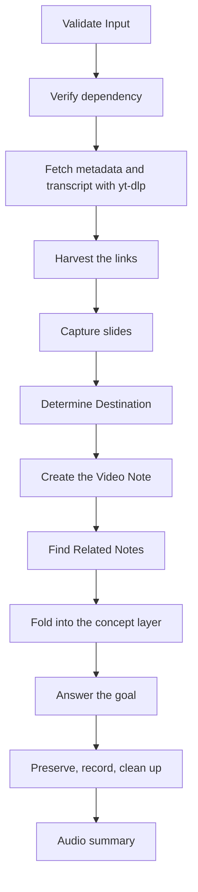
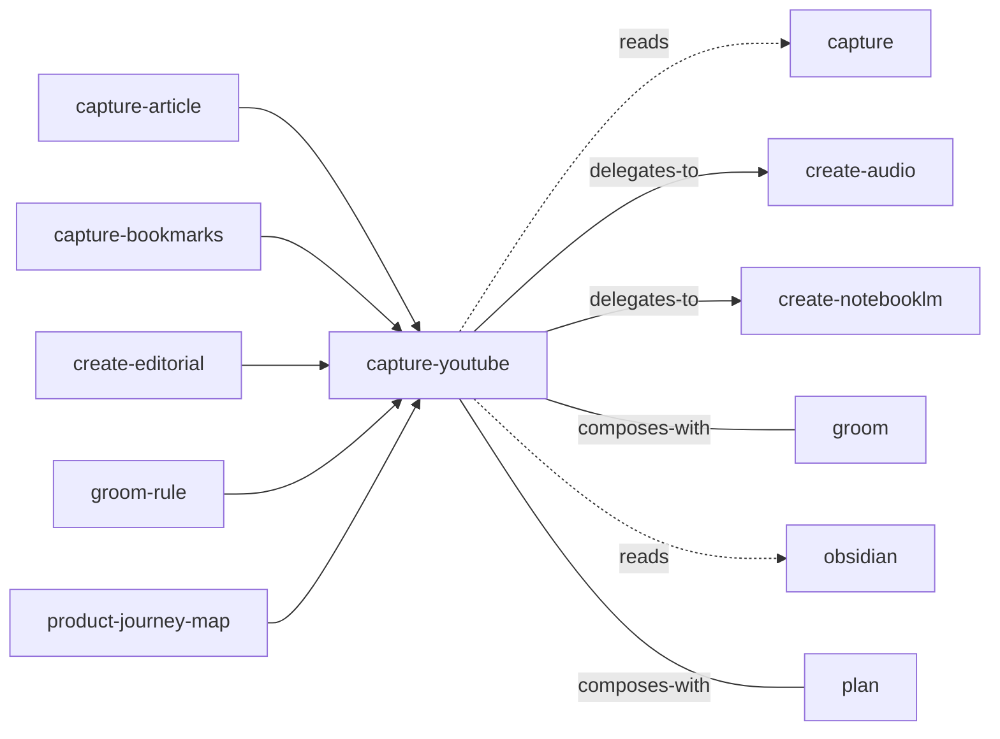

<!-- GENERATED:START -->

Extract knowledge from a YouTube video into topic-based notes, harvest the links it names into link cards, archive the transcript, and optionally answer a specific question or produce an audio summary.

**Theme** knowledge / Bring it in · **Maturity** `stable` · **Invoke** `/capture-youtube`

### Triggers
- The user shares a YouTube URL and wants detailed notes
- Mentions extracting knowledge from a video
- Wants the links or resources a video mentions
- Wants a video to answer a question
- Says 'process youtube'

### Parameters

| Parameter | Kind | Required |
|---|---|---|
| `<youtube-url...>` | argument | yes |
| `--goal` | flag (takes a value) | no |
| `--audio` | flag | no |
| `--links-only` | flag | no |
| `--slides` | flag | no |
| `--report-only` | flag | no |

### Flow

### Connections

**Calls out to**
- `capture` — reads
- `create-audio` — delegates-to
- `create-notebooklm` — delegates-to
- `groom` — composes-with
- `obsidian` — reads
- `plan` — composes-with

**Called by**
- `capture`
- `capture-article`
- `capture-bookmarks`
- `create-editorial`
- `groom-rule`
- `product-journey-map`

### External tools

`curl`, `ffmpeg`, `jq`, `notebooklm`, `uv`, `whisper-cli`, `yt-dlp`

### Vault paths touched
- `Knowledge/AI/<page>.md`
- `Personal/Health`
- `Sources/links/<Title>.md`
- `Sources/links/Links.base`
- `Sources/videos/<title>.md`
- `Sources/videos/answers/<...>.md`
- `Sources/videos/answers/<goal-slug>.md`
- `Sources/videos/answers/<slug>`
- `Sources/videos/raw/<slug>.md`
- `Sources/videos/raw/<slug>.timestamped.md`
- `_Triage/yt-capture-<slug>.md`
- `~Attachments/IMG-`

### Files
- `references/audio.md`
- `references/goal-mode.md`
- `references/link-harvest.md`
- `references/note-template.md`
- `references/slides.md`
- `scripts/extract-slides.sh`

### Source

`skills/knowledge/capture-youtube/SKILL.md` · 679 lines · `sha c6805941799433c6`

<!-- GENERATED:END -->

## Notes

<!-- Hand-written. Never overwritten by the generator. -->
