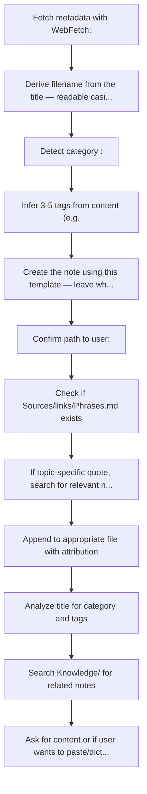
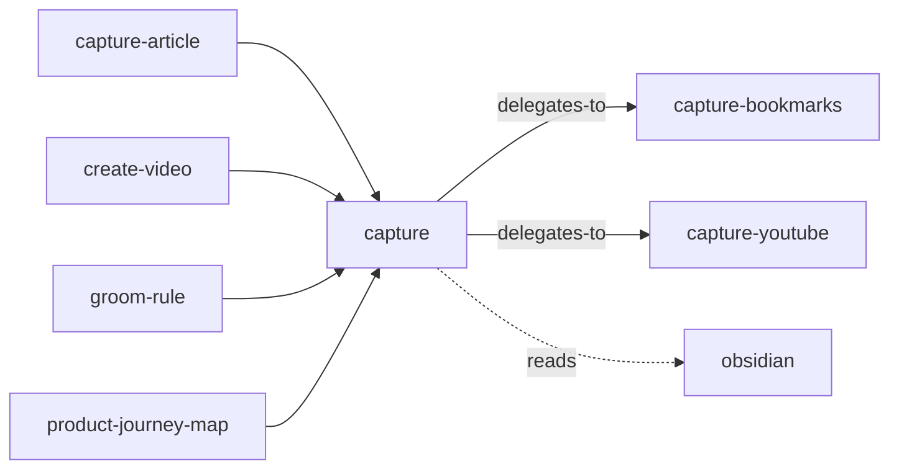

<!-- GENERATED:START -->

Smart capture for ideas, tasks, URLs, YouTube videos, and quotes. Auto-detects input type and routes to the right location in the vault.

**Theme** knowledge / Bring it in · **Maturity** `stable` · **Invoke** `/capture`

### Triggers
- The user says '/capture'
- Wants to save something quickly
- Shares a YouTube URL
- Mentions adding a task
- Link
- Note

### Flow

### Connections

**Calls out to**
- `capture-bookmarks` — delegates-to
- `capture-youtube` — delegates-to
- `obsidian` — reads

**Called by**
- `capture-article`
- `capture-bookmarks`
- `capture-youtube`
- `create-video`
- `groom-rule`
- `obsidian`
- `product-journey-map`

### External tools

`yt-dlp`

### Vault paths touched
- `Knowledge/<category>/<title>.md`
- `Knowledge/Angular`
- `Knowledge/Sources`
- `Personal/Health`
- `Sources/links/<Name>.md`
- `Sources/links/<Title>.md`
- `Sources/links/Impeccable.md`
- `Sources/links/Links.base`
- `Sources/links/Phrases.md`
- `Sources/videos`

### Source

`skills/knowledge/capture/SKILL.md` · 198 lines · `sha e25db7b9994d472c`

<!-- GENERATED:END -->

## Notes

<!-- Hand-written. Never overwritten by the generator. -->
