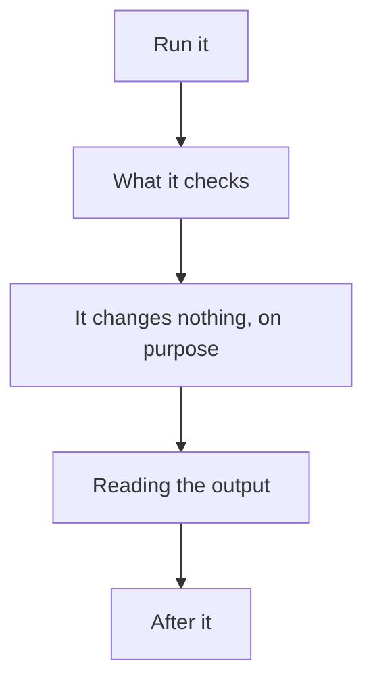
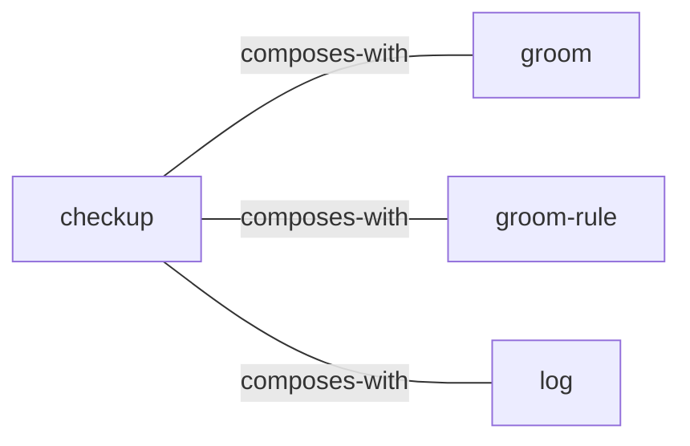

<!-- GENERATED:START -->

One command that runs every read-only health check across the skills and the vault and reports what needs attention. Rules on published output, the graders themselves, skills that never fire, vault-versus-blog drift, upstream drift, repeated friction, and how long since the vault was groomed.

**Theme** kaiju / Keep it honest · **Maturity** `stable` · **Invoke** `/checkup`

### Triggers
- The user says '/checkup'
- 'is everything ok'
- 'check my setup'
- 'what needs attention'
- 'health check'
- 'anything broken'
- Comes back after time away and wants to know what rotted

### Parameters

| Parameter | Kind | Required |
|---|---|---|
| `--quick` | flag | no |

### Flow

### Connections

**Calls out to**
- `groom` — composes-with
- `groom-rule` — composes-with
- `log` — composes-with

### Source

`skills/projects/checkup/SKILL.md` · 91 lines · `sha f00d5fb309c477fe`

<!-- GENERATED:END -->

## Notes

<!-- Hand-written. Never overwritten by the generator. -->
