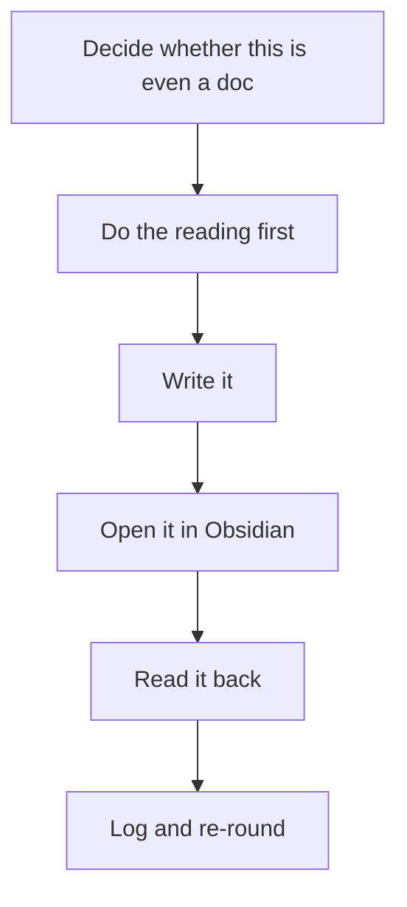
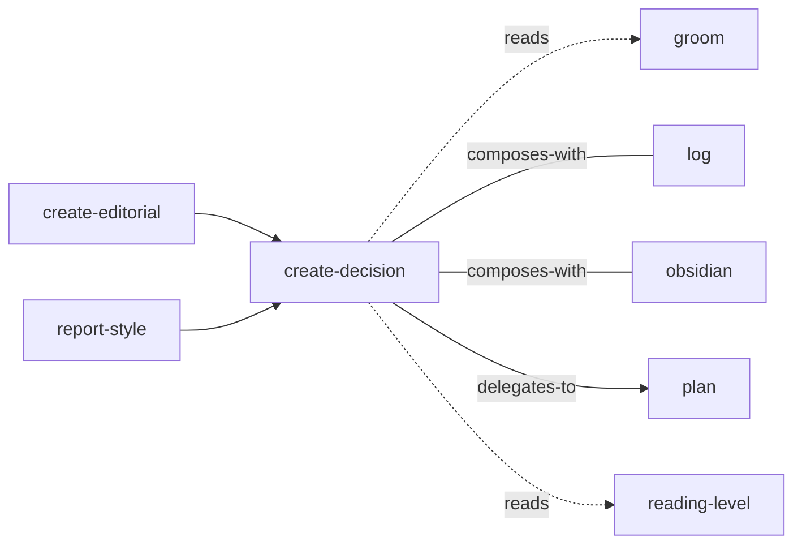

<!-- GENERATED:START -->

Escalate a decision out of chat and into a document the user can read, think about, and answer in their own time.

**Theme** output-style / How Claude responds · **Maturity** `beta` · **Invoke** `/create-decision`

### Triggers
- A choice is too big for an inline prompt: several questions interact
- The user needs findings or evidence in front of them before choosing
- The options need real explanation
- You are about to ask a question whose answer changes the direction of the work

### Parameters

| Parameter | Kind | Required |
|---|---|---|
| `<what is being decided>` | argument | yes |
| `--round-2` | flag | no |
| `--no-open` | flag | no |

### Flow

### Connections

**Calls out to**
- `groom` — reads
- `log` — composes-with
- `obsidian` — composes-with
- `plan` — delegates-to
- `reading-level` — reads

**Called by**
- `create-editorial`
- `obsidian`
- `plan`
- `reading-level`
- `report-style`

### Source

`skills/knowledge/create-decision/SKILL.md` · 416 lines · `sha 5f6d4c823a742a17`

<!-- GENERATED:END -->

## Notes

<!-- Hand-written. Never overwritten by the generator. -->
