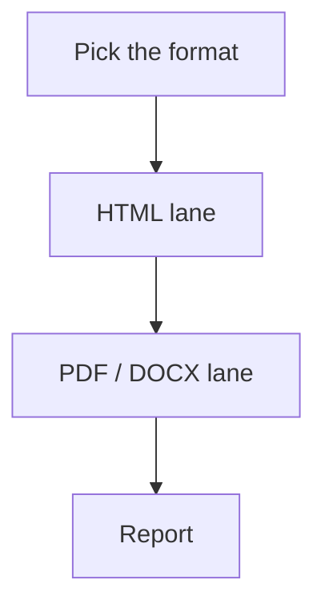
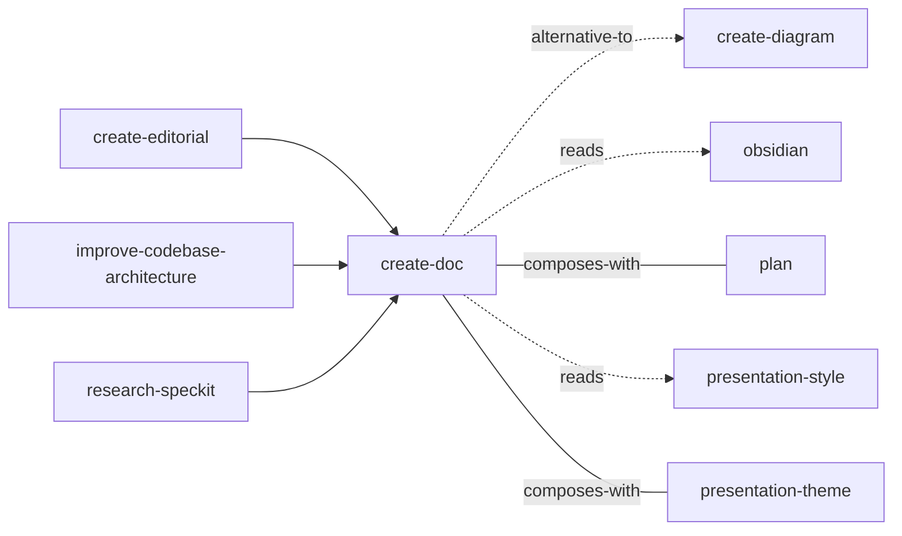

<!-- GENERATED:START -->

Produce a standalone document for SOMEONE ELSE from a note or a brief — HTML, PDF, or Word (.docx).

**Theme** media / Authored · **Maturity** `stable` · **Invoke** `/create-doc`

### Triggers
- The user says '/create-doc'
- 'page'
- 'doc'
- 'brief'
- 'report'
- 'explainer'
- 'make this visual'
- 'render this as a page'

### Parameters

| Parameter | Kind | Required |
|---|---|---|
| `<topic, note path, or folder>` | argument | yes |
| `--html` | flag | no |
| `--pdf` | flag | no |
| `--docx` | flag | no |
| `--theme` | flag (takes a value) | no |
| `--out` | flag (takes a value) | no |
| `--combine` | flag (takes a value) | no |

### Flow

### Connections

**Calls out to**
- `create-diagram` — alternative-to
- `obsidian` — reads
- `plan` — composes-with
- `presentation-style` — reads
- `presentation-theme` — composes-with

**Called by**
- `create-editorial`
- `improve-codebase-architecture`
- `obsidian`
- `research-speckit`

### External tools

`pandoc`

### Vault paths touched
- `Projects/<project>/<area>/caching-options.html`
- `Projects/<project>/product/<feature>/<slug>.html`

### Files
- `references/design.md`
- `references/diagrams.md`
- `references/sections.md`
- `references/themes.md`
- `references/viewers.md`
- `scripts/md_convert.py`

### Source

`skills/knowledge/create-doc/SKILL.md` · 280 lines · `sha fc7eb6e69b9963ae`

<!-- GENERATED:END -->

## Notes

<!-- Hand-written. Never overwritten by the generator. -->
