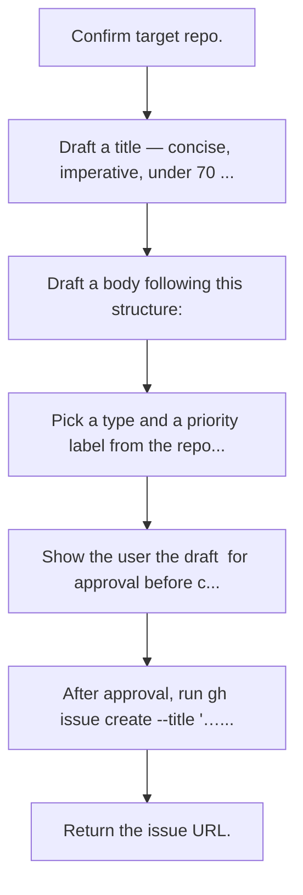
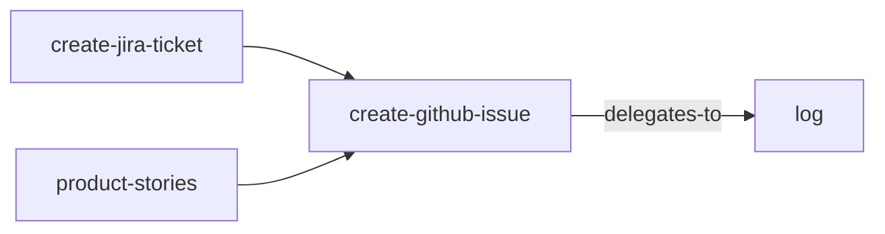

<!-- GENERATED:START -->

Create a GitHub issue from a brief description, screenshot, or rough notes.

**Theme** spec-code / Feed other systems · **Maturity** `stable` · **Invoke** `/create-github-issue`

### Triggers
- The user says 'create an issue'
- 'open a github issue'
- '/create-github-issue'
- Hands off something that should become tracked work in a repo.

### Parameters

| Parameter | Kind | Required |
|---|---|---|
| `<repo? + description or screenshot>` | argument | yes |

### Flow

### Connections

**Calls out to**
- `log` — delegates-to

**Called by**
- `create-jira-ticket`
- `product-stories`

### External tools

`gh`, `git`

### Source

`skills/github/create-github-issue/SKILL.md` · 101 lines · `sha e30445479de2ca13`

<!-- GENERATED:END -->

## Notes

<!-- Hand-written. Never overwritten by the generator. -->
