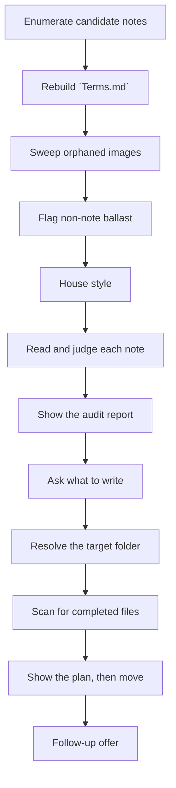
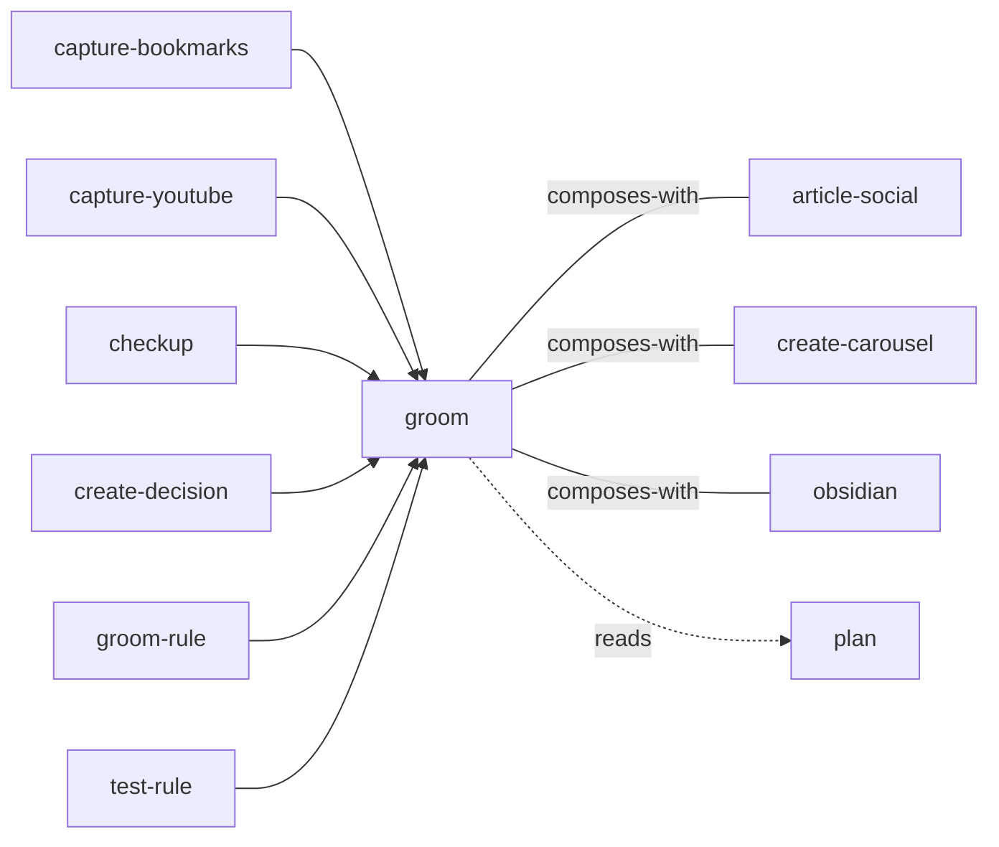

<!-- GENERATED:START -->

One grooming skill, scope as an argument. `groom vault [subfolder]` — cross-vault pass: auto-removes orphaned images to _Triage/Trash/ with a restorable grace window (mechanical + reversible), and FLAGS — never executes — misfiled / duplicate / low-value / stale notes via `groom: review` frontmatter + a dated digest (judgment + propose-only). `groom knowledge <topic>` — the same audit over one Knowledge/<topic>/ folder, plus stubs, near-duplicates, broken links, missing frontmatter, and a regenerable index.md. `groom project <name>` — a DIFFERENT operation: moves finished items into Done/ by terminal frontmatter `status`.

**Theme** knowledge / Tidy · **Maturity** `stable` · **Invoke** `/groom`

### Triggers
- The user says '/groom'
- '/groom vault'
- '/groom knowledge'
- '/groom project'
- Wants to clean up / tidy / audit / reorganize the vault or a folder
- Remove orphaned or unreferenced images
- Flag misfiled / duplicate / low-value notes
- Find duplicates or stubs in a knowledge area

### Parameters

| Parameter | Kind | Required |
|---|---|---|
| `<topic>` | argument | yes |
| `<name>` | argument | yes |
| `--dry-run` | flag | no |
| `--no-images` | flag | no |

### Flow

### Connections

**Calls out to**
- `article-social` — composes-with
- `create-carousel` — composes-with
- `obsidian` — composes-with
- `plan` — reads

**Called by**
- `capture-bookmarks`
- `capture-youtube`
- `checkup`
- `create-decision`
- `groom-rule`
- `obsidian`
- `test-rule`

### External tools

`git`, `specify`

### Vault paths touched
- `Knowledge/<topic>`
- `Knowledge/AI`
- `Projects/<name>`
- `Projects/sdd`
- `Projects/speckit`
- `_Triage/Trash/<date>`
- `_Triage/Trash/manifest.json`
- `_Triage/groom-2026-06-13-full.md`
- `~Attachments/Carousels`

### Files
- `references/image-sweep.md`
- `references/knowledge-audit.md`
- `references/verdicts.md`

### Source

`skills/knowledge/groom/SKILL.md` · 302 lines · `sha b40b91b1f82cd86d`

<!-- GENERATED:END -->

## Notes

<!-- Hand-written. Never overwritten by the generator. -->
