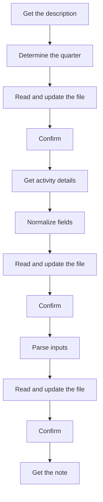
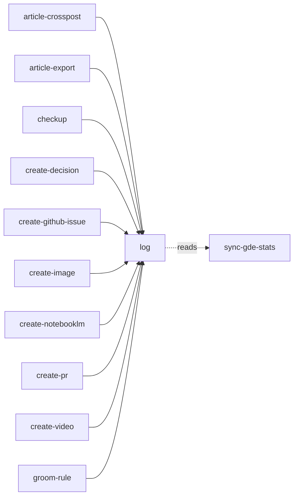

<!-- GENERATED:START -->

Append a dated record to one of the four tracking files, with what-to-log as an argument. `log achievement <text>` → Work/Achievements.md (year + quarter, for the yearly review). `log activity <details|screenshot>` → Personal/GDE/GDE-Activities.md (the GDE/Advocu table that sync-gde-stats updates). `log demo <type> <note>` → Work/Weekly Demos.md (feature / flag-add / flag-remove / devx, by week). `log retro <note>` → Work/Retros.md (what went well / what could improve / action items).

**Theme** work / Record · **Maturity** `stable` · **Invoke** `/log`

### Triggers
- The user says '/log'
- '/log achievement'
- '/log activity'
- '/log demo'
- '/log retro'
- Ships something significant or demo-worthy
- Mentions an accomplishment or milestone
- Completes a feature or flag change or DevX improvement

### Parameters

| Parameter | Kind | Required |
|---|---|---|
| `<text>` | argument | yes |
| `<details|screenshot>` | argument | yes |
| `<type>` | argument | yes |
| `<note>` | argument | yes |
| `<note>` | argument | yes |

### Flow

### Connections

**Calls out to**
- `sync-gde-stats` — reads

**Called by**
- `article-crosspost`
- `article-export`
- `checkup`
- `create-decision`
- `create-github-issue`
- `create-image`
- `create-notebooklm`
- `create-pr`
- `create-video`
- `groom-rule`
- `improve-codebase-architecture`
- `obsidian`
- `product-journey-map`
- `product-prd`
- `product-roadmap`
- `sync-skills`
- `writing`

### Vault paths touched
- `Personal/GDE/GDE-Activities.md`
- `Work/Achievements.md`
- `Work/Retros.md`
- `Work/Weekly`

### Source

`skills/work/log/SKILL.md` · 267 lines · `sha 28da2bad5af4dee5`

<!-- GENERATED:END -->

## Notes

<!-- Hand-written. Never overwritten by the generator. -->
