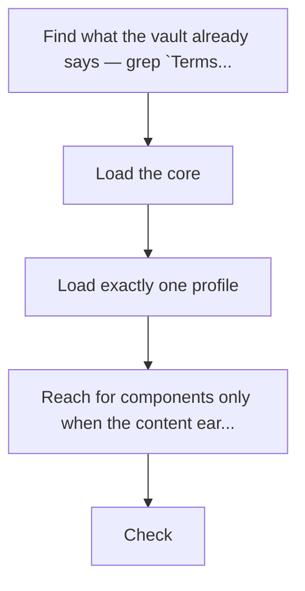
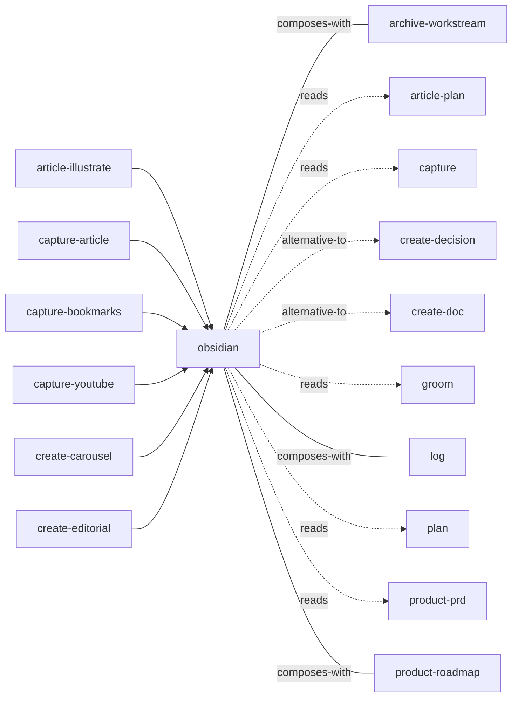

<!-- GENERATED:START -->

How to write in Alfredo's Obsidian vault — the structure, not the voice. Frontmatter schemas, `lifespan:`, the component vocabulary (cards, tickets, phases, capability matrices, terminals, figures, story maps), diagrams, and where a note goes. Load this before creating or editing ANY note in the vault: reports, PRDs, research, knowledge notes, backlog items.

**Theme** output-style / House style · **Maturity** `stable` · **Invoke** `/obsidian`

### Triggers
- The user says '/obsidian'
- '/brief'
- 'make a report'
- 'a page'
- 'a doc'
- 'an explainer'
- 'make this visual'
- When another skill is about to write a note into the vault

### Parameters

| Parameter | Kind | Required |
|---|---|---|
| `<what you are writing>` | argument | yes |

### Flow

### Connections

**Calls out to**
- `archive-workstream` — composes-with
- `article-plan` — reads
- `capture` — reads
- `create-decision` — alternative-to
- `create-doc` — alternative-to
- `groom` — reads
- `log` — composes-with
- `plan` — reads
- `product-prd` — reads
- `product-roadmap` — composes-with
- `product-stories` — composes-with
- `writing` — reads

**Called by**
- `archive-workstream`
- `article-illustrate`
- `capture`
- `capture-article`
- `capture-bookmarks`
- `capture-youtube`
- `create-carousel`
- `create-decision`
- `create-doc`
- `create-editorial`
- `create-jira-ticket`
- `create-notebooklm`
- `groom`
- `groom-rule`
- `plan-workstream`
- `product-journey-map`
- `product-prd`
- `product-roadmap`
- `product-stories`
- `product-story-map`
- `reading-level`
- `report-style`
- `writing`

### Vault paths touched
- `Work/_guide.md`

### Files
- `references/bases-functions.md`
- `references/bases.md`
- `references/canvas-examples.md`
- `references/canvas.md`
- `references/components.md`
- `references/core.md`
- `references/design-doc.md`
- `references/diagrams.md`
- `references/knowledge-note.md`
- `references/report.md`

### Source

`skills/knowledge/obsidian/SKILL.md` · 145 lines · `sha c10a1fb8b5e6e5ae`

<!-- GENERATED:END -->

## Notes

<!-- Hand-written. Never overwritten by the generator. -->
