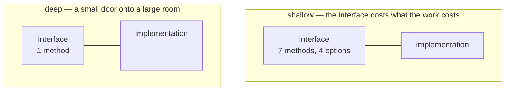

# Diagrams

**Mermaid or Excalidraw. Never inline SVG.** Both render natively in Obsidian, both survive
`git diff`, and both keep their labels as real searchable text.

## Which tool when

- **Mermaid is the default for every note** — flows, lifecycles, sequences, states.
  Text, diffable, themeable; the theme init block and the edge rules are in `components.md` → *Mermaid rules*.
- **Excalidraw only when the drawing needs hand-placement you will come back and edit**
  (article diagrams with custom layout). A one-shot generated Excalidraw nobody will
  reopen should have been mermaid.
- **Canvas is fine for box-and-arrow thinking maps** arranged spatially (a story-map
  wall, a cluster board); embed with `![[name.canvas]]`. Never in guides or reports —
  canvas is JSON: invisible to search, useless in `git diff`.

## Mermaid

**Theme it in the block.** Mermaid writes `fill`/`stroke` as inline attributes on
the SVG, so a CSS variable cannot override them. Without this you get lavender
nodes in a canary-yellow cluster:

```
%%{init: {'theme':'base','themeVariables':{
  'primaryColor':'#eef4fd','primaryTextColor':'#1f2428','primaryBorderColor':'#3d59a1',
  'lineColor':'#8b939c','fontFamily':'Geist, ui-sans-serif, sans-serif','fontSize':'13px',
  'clusterBkg':'#f8fafc','clusterBorder':'#dde2e8','edgeLabelBackground':'#ffffff'
}}}%%
```

**Draw the constraints, not every true relationship.** If `A → B → E`, do NOT also
draw `A → E`. It is true, it is transitive, and it turns the graph into spaghetti
that hides the actual shape. A dependency diagram earns its keep by showing the
*chains*; every redundant edge costs you one.

**Give roles a `classDef`.** The anchor (the thing that blocks the most) should
look like the anchor. Free work with no dependencies should look pickup-able.

## Two diagrams that argue about architecture

Most diagrams show *what connects to what*. These two show *whether a design is any good*, which is
a different job and the one a deepening report needs. Adopted from mattpocock/skills.

**Mass diagram — is this module deep or shallow?** Draw the interface and the implementation as two
stacked rectangles. An interface nearly as tall as its implementation is **shallow**: you pay almost
as much to use the module as you would to write it yourself. A short interface over a tall
implementation is **deep**: a small surface hiding real work. The argument is made by the
proportions, so keep them honest and let the shapes carry it.



**Call-graph collapse — what does the deepening actually remove?** Draw the current call graph
beside the proposed one. The argument is the *count of edges crossing the seam*, not the count of
boxes. A deepening that keeps the same number of crossings has moved code without buying anything.

Use them together: the mass diagram says a module is shallow, the call-graph collapse says what
deepening it would remove. Neither belongs on a note that is not arguing about design.

## Schedules — do not fabricate them

A Gantt chart renders with a confident "today" line and looks like a plan. If you invent the
dates and durations, you have produced an authoritative-looking lie that the reader will
trust in three weeks having forgotten you made it up.

If there are no real estimates, **either omit the schedule or derive it from data that
exists and say so on the page** — the t-shirt sizes recorded on the tickets, for example
(`small` = 2d, `medium` = 4d, `larger` = 8d), laid against the real dependency order. State
the mapping in a `[!warning]` above the chart and tell the reader to read the shape, not the
dates.
