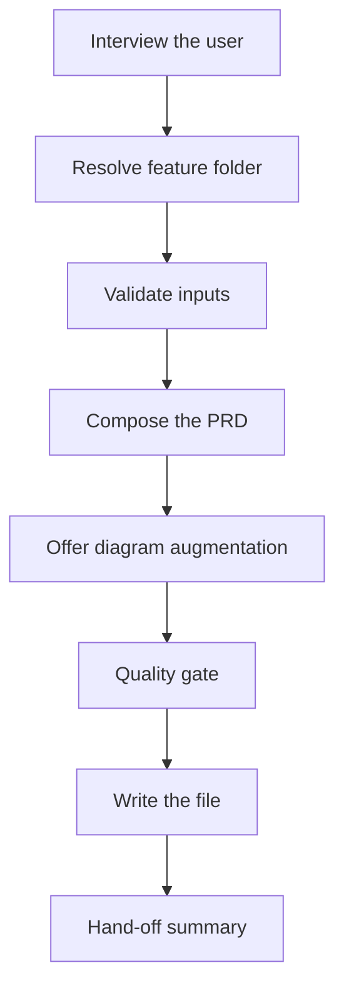
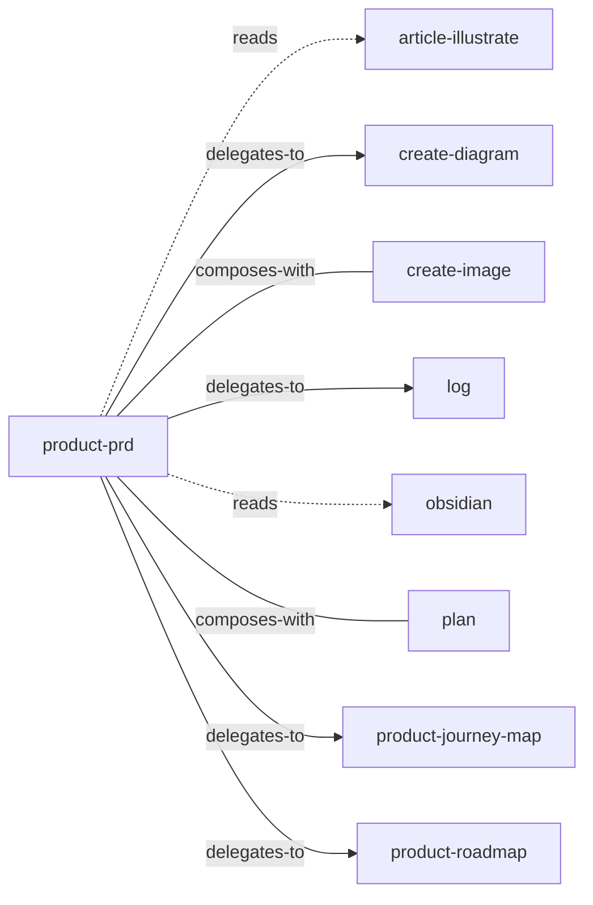

<!-- GENERATED:START -->

Write a Product Requirements Document (PRD) for a feature as a markdown artifact at Projects/<project>/product/<feature>/<Feature Name> PRD.md. Pulls upstream context (journey-map, mockups, notes) from the same feature folder automatically.

**Theme** spec-code / Spec pipeline · **Maturity** `stable` · **Invoke** `/product-prd`

### Triggers
- The user says '/product-prd'
- '/prd'
- Wants to spec a feature/epic/initiative for engineering handoff
- Has a journey map ready and needs the requirements document.

### Parameters

| Parameter | Kind | Required |
|---|---|---|
| `<feature-slug>` | argument | yes |

### Flow

### Connections

**Calls out to**
- `article-illustrate` — reads
- `create-diagram` — delegates-to
- `create-image` — composes-with
- `log` — delegates-to
- `obsidian` — reads
- `plan` — composes-with
- `product-journey-map` — delegates-to
- `product-roadmap` — delegates-to

**Called by**
- `obsidian`
- `product-journey-map`
- `product-roadmap`

### Vault paths touched
- `Projects/<project>/<feature>-mockups.md`
- `Projects/<project>/product/<feature>`
- `~Attachments/Projects/<project>/product/<feature>/<diagram-slug>.excalidraw`

### Files
- `references/EXAMPLE.md`
- `references/TEMPLATE.md`

### Source

`skills/product/product-prd/SKILL.md` · 184 lines · `sha 89fba4ed94352db0`

<!-- GENERATED:END -->

## Notes

<!-- Hand-written. Never overwritten by the generator. -->
