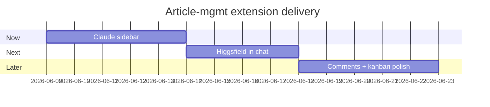

<!-- Lives at: Projects/command-center/product/article-mgmt/roadmap.md -->
<!-- Reads: ./prd.md (sibling). Next: /product-stories article-mgmt --slice now -->

# Roadmap — Article Management Extension

## Summary

Ship the persistent Claude sidebar first (Now) because the PRD's top moment of truth is the first refinement turn — every other capability becomes easier to evaluate once the sidebar is live. Inline image generation comes Next because it's the second-biggest source of tool-switching friction. Comments and kanban polish ship Later — both are quality-of-life wins that don't unblock article cadence on their own.

## Slice: Now

**Outcome:** Users can chat with Claude about the active article in a persistent sidebar, with article + series context, and trigger phase actions (DRAFT / EDIT / ILLUSTRATE / EXPORT) without leaving the editor.

**Requirements covered:** R001, R002, R003 + NFR001, NFR003, NFR004

**Depends on:** —

**Deferred from this slice:** image generation (R007–R009), comments (R004–R006), kanban polish (R010)

**Definition of done:**
- A new chat sidebar replaces `terminal-panel.tsx` in `article-editor.tsx`
- Sidebar streams Claude responses with first token ≤ 1s (NFR001)
- Chat history persists across page reloads (NFR003)
- DRAFT / EDIT / ILLUSTRATE / EXPORT buttons invoke the existing skills with the active article path

---

## Slice: Next

**Outcome:** Users can generate Higgsfield images from the chat sidebar and insert them into the article body without opening a terminal.

**Requirements covered:** R007, R008, R009

**Depends on:** Now landed (chat sidebar exists to host the image-gen flow)

**Deferred from this slice:** kanban polish (R010), telemetry-driven refinement metrics (NFR002 — defer to Later if the manual log is fine)

**Definition of done:**
- Chat sidebar surfaces a 2×2 grid of Higgsfield results when the user asks for an image
- INSERT action writes a `![[IMG-…]]` wikilink at the cursor and saves the PNG to `~Attachments/<project>/<feature>/<article-slug>/`
- Generated images render inline in Obsidian (existing convention)

---

## Slice: Later

**Outcome:** Users can leave inline comments on paragraphs (with sidebar roll-up) and see hover-expanded kanban cards that show full descriptions and inline actions.

**Requirements covered:** R004, R005, R006, R010 + NFR002

**Depends on:** Next landed

**Deferred from this slice:** —

**Definition of done:**
- Comments table in Prisma schema migrated; comment CRUD wired up
- Inline gutter annotations + sidebar roll-up filter `ALL / OPEN / RESOLVED`
- Kanban hover expands a card; other cards fade by 10%
- Refinement-event telemetry writes to `~/.command-center/refine-events.jsonl`

---

## Coverage check

| Requirement | Title (short) | Slice | Notes |
|---|---|---|---|
| R001 | Persistent chat sidebar | Now | |
| R002 | Sidebar auto-context | Now | |
| R003 | Phase-action buttons | Now | |
| R004 | Inline comment add | Later | |
| R005 | Comments sidebar roll-up | Later | |
| R006 | Comment resolve | Later | |
| R007 | Higgsfield in chat | Next | |
| R008 | Insert image to article | Next | |
| R009 | Image attachments folder | Next | |
| R010 | Kanban hover-expand | Later | |
| NFR001 | Streaming ≤1s | Now | |
| NFR002 | Refine telemetry | Later | |
| NFR003 | Local persistence | Now | |
| NFR004 | Brutalism theme tokens | Now | |

## Mermaid Gantt

## Open decisions

- **Comments vs. kanban polish ordering within Later** — both are independent; could ship in either order. Default: comments first because they reduce in-flight friction; kanban polish is a passive UX improvement.
- **NFR002 telemetry** — could ship in Now (if the chat sidebar already touches the refinement flow) or Later (if the comment work is what reshapes that area anyway). Defaulted to Later for grouping with comments.
- **Prompt caching for the chat sidebar** — risk #5 in the PRD. If Claude API costs spike during Now, pull a caching task forward instead of deferring.
