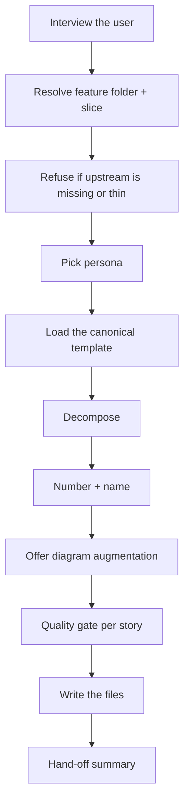
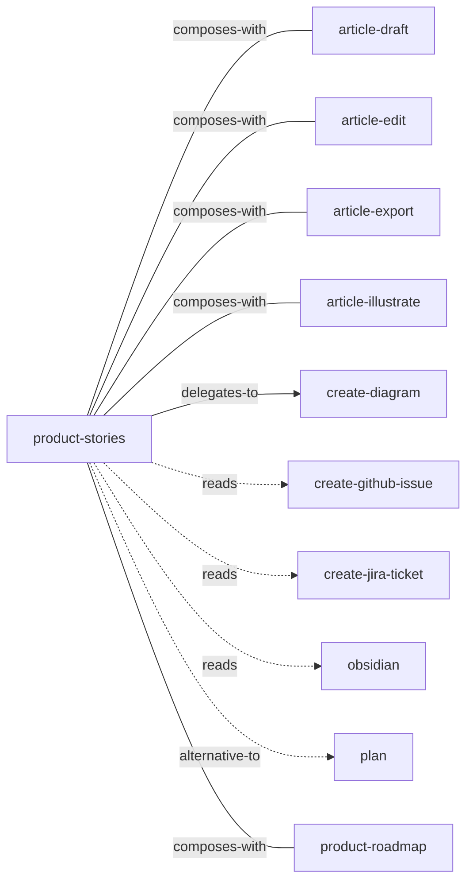

<!-- GENERATED:START -->

Decompose a roadmap slice into user stories with Given/When/Then acceptance criteria and INVEST validation. Writes one file per story to Projects/<project>/product/<feature>/stories/<Story Name>.md. Markdown only — does NOT push to GitHub or Jira (that's `/create-github-issue` or `/create-jira-ticket`).

**Theme** spec-code / Spec pipeline · **Maturity** `stable` · **Invoke** `/product-stories`

### Triggers
- The user says '/product-stories'
- '/stories'
- Wants to break a slice into trackable work items
- Has an approved roadmap ready.

### Parameters

| Parameter | Kind | Required |
|---|---|---|
| `<feature-slug>` | argument | yes |
| `--slice` | flag | no |

### Flow

### Connections

**Calls out to**
- `article-draft` — composes-with
- `article-edit` — composes-with
- `article-export` — composes-with
- `article-illustrate` — composes-with
- `create-diagram` — delegates-to
- `create-github-issue` — reads
- `create-jira-ticket` — reads
- `obsidian` — reads
- `plan` — alternative-to
- `product-roadmap` — composes-with

**Called by**
- `create-jira-ticket`
- `obsidian`
- `product-roadmap`

### Vault paths touched
- `Projects/<project>/product/<feature>/stories`
- `~Attachments/Projects/<project>/product/<feature>/stories/<story-slug>-diagram.excalidraw`

### Files
- `references/EXAMPLE.md`
- `references/TEMPLATE.md`
- `references/canonical-template.md`

### Source

`skills/product/product-stories/SKILL.md` · 195 lines · `sha 9f475aa51e6d6cb2`

<!-- GENERATED:END -->

## Notes

<!-- Hand-written. Never overwritten by the generator. -->
