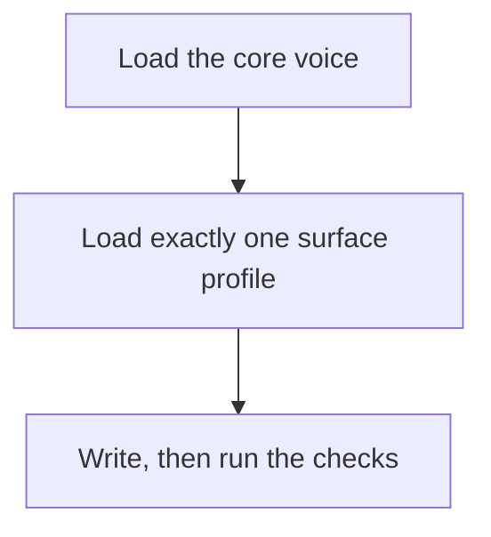
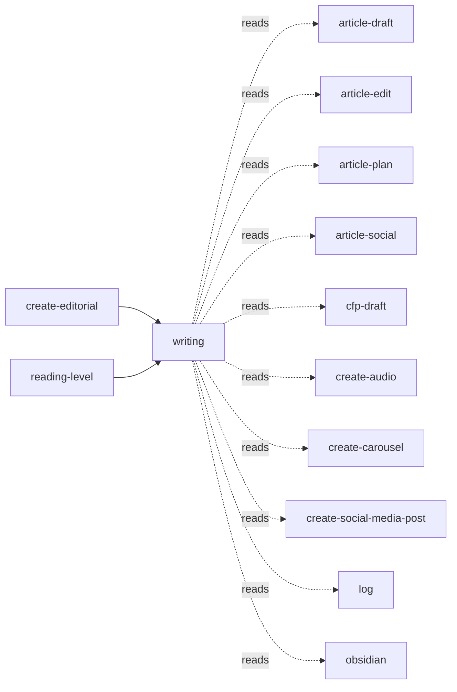

<!-- GENERATED:START -->

Alfredo's writing voice, structure, and house rules. Load this before drafting, editing, or polishing ANY prose a human will read: blog and Medium articles, LinkedIn or X posts, CFP abstracts, vault notes, READMEs, release notes, video scripts, summaries, and persuasive copy (landing pages, ads, launch copy, product descriptions, sales emails, promo scripts) via the Ogilvy persuasion profile. Use this skill whenever the user says '/writing', asks to write, draft, edit, rewrite, or polish something, asks whether something "sounds like me", wants copy that sells rather than copy that wins awards, or when another skill needs voice calibration. Make sure to use it even when the user does not explicitly mention voice or tone.

**Theme** output-style / House style · **Maturity** `stable` · **Invoke** `/writing`

### Flow

### Connections

**Calls out to**
- `article-draft` — reads
- `article-edit` — reads
- `article-plan` — reads
- `article-social` — reads
- `cfp-draft` — reads
- `create-audio` — reads
- `create-carousel` — reads
- `create-social-media-post` — reads
- `log` — reads
- `obsidian` — reads
- `plan` — reads

**Called by**
- `article-draft`
- `article-edit`
- `article-plan`
- `article-social`
- `cfp-draft`
- `create-audio`
- `create-carousel`
- `create-editorial`
- `create-social-media-post`
- `reading-level`
- `groom-rule`
- `obsidian`
- `presentation-storyboard`
- `quarterly-reflection`
- `report-style`

### Files
- `references/article.md`
- `references/cfp.md`
- `references/core-voice.md`
- `references/explainer.md`
- `references/general.md`
- `references/ogilvy-principles.md`
- `references/persuasion.md`
- `references/social.md`
- `references/structure.md`
- `references/vault-note.md`

### Source

`skills/content/writing/SKILL.md` · 80 lines · `sha 4ae6bee1a837d216`

<!-- GENERATED:END -->

## Notes

<!-- Hand-written. Never overwritten by the generator. -->
